#  Street Router 
Application supports user turn-by-turn navigation using motorbike or bus and support on smart watch (Capstone Project Winter 2015)

# Team
- Huỳnh Quang Thảo 
- Trần Thanh Ngoan
- Nguyễn Trung Nam
- Hà Kim Quy
- Supervisor: **Mr.Kiều Trọng Khánh**

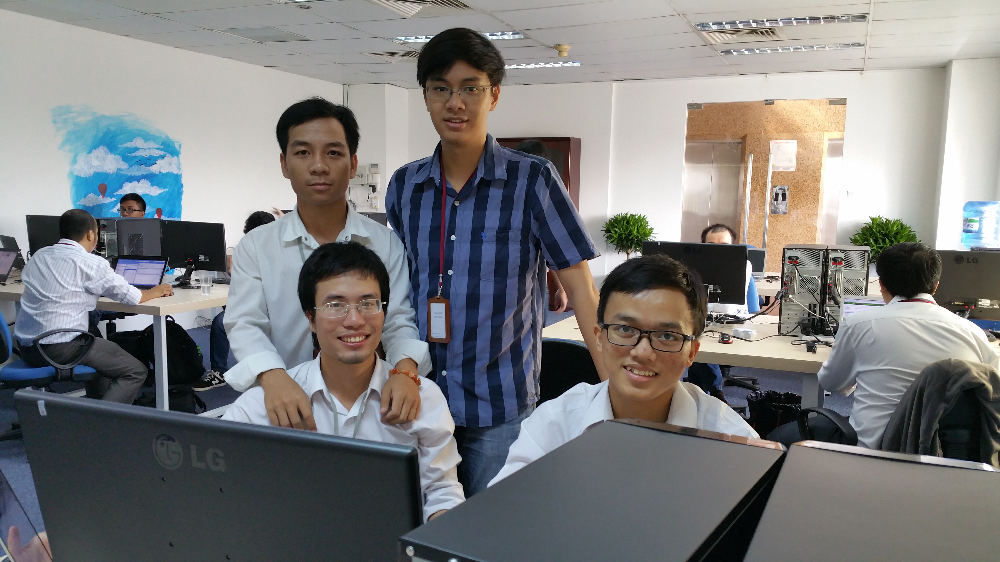

# What it looks like

<table>
  <tr>
    <td><b>Main screen</b></td>
    <td><b>Bus Search Screen</b></td>
    <td><b>Motor Search Screen</b></td>
  </tr>
  <tr>
    <td>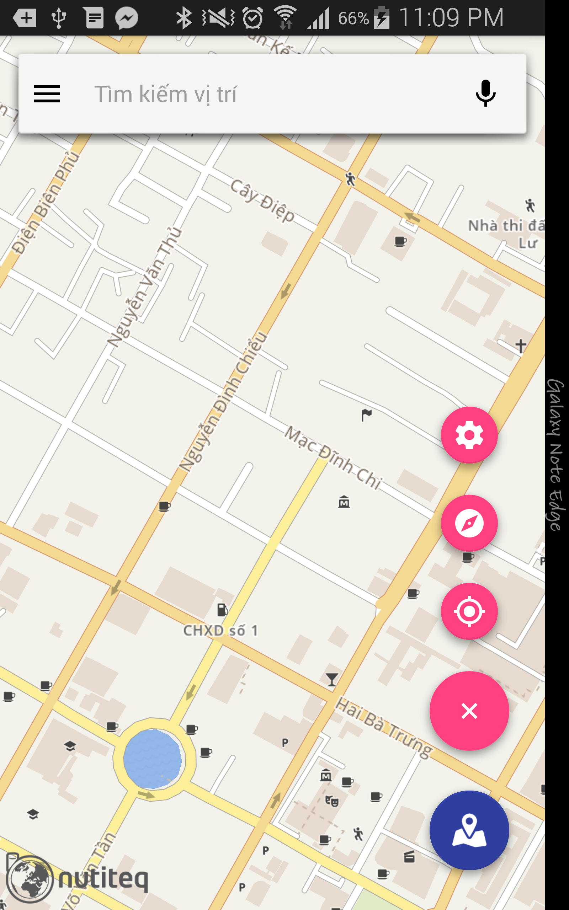&nbsp;&nbsp;&nbsp;</td>
    <td>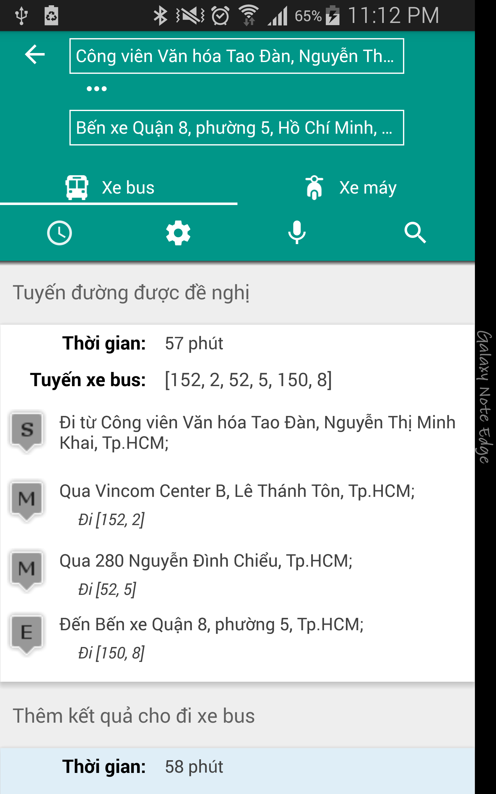&nbsp;&nbsp;&nbsp;</td>
    <td>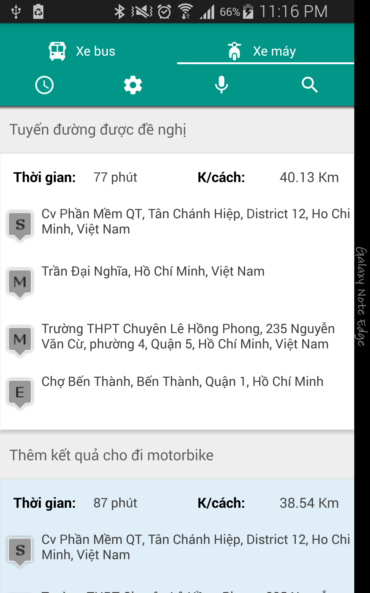&nbsp;&nbsp;&nbsp;</td>
  </tr>
</table>

<table>
  <tr>
    <td><b>Bus Detail Screen</b></td>
    <td><b>Optional Parameter Screen</b></td>
    <td><b>Detail Map Screen</b></td>
  </tr>
  <tr>
    <td>&nbsp;&nbsp;&nbsp;</td>
    <td>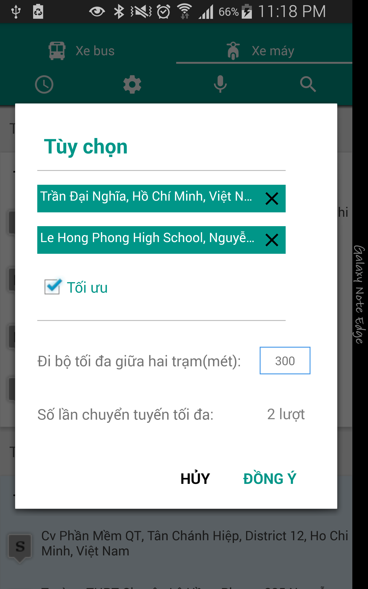&nbsp;&nbsp;&nbsp;</td>
    <td>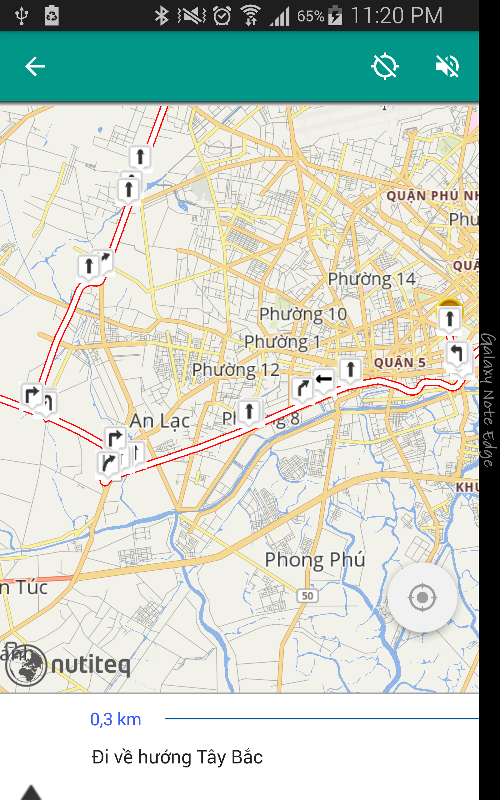&nbsp;&nbsp;&nbsp;</td>
  </tr>
</table>

<table>
  <tr>
    <td><b>Wear Detail Map</b></td>
    <td><b>Wear Notification</b></td>
  </tr>
  <tr>
    <td>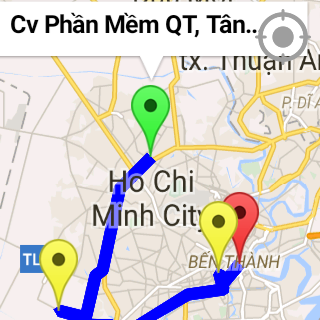&nbsp;&nbsp;&nbsp;</td>
    <td>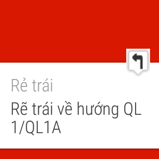&nbsp;&nbsp;&nbsp;</td>
  </tr>
</table>

# Technologies
- Server: Java Servlet, Hibernate, MySQL, Redis
- Algorithm: <a href="http://research.microsoft.com/pubs/156567/raptor_alenex.pdf">Raptor algorithm (Microsoft, 2012)</a>
- Android Development
    - Material Layout implementation
    - <a href="http://www.nutiteq.com/apps/offline-maps-3d/">Nutiteq Map Offline technology</a>
    - GPS Technology
    - Google Direction API, Google Map API, Google Autocomplete API
- Android Wear Development

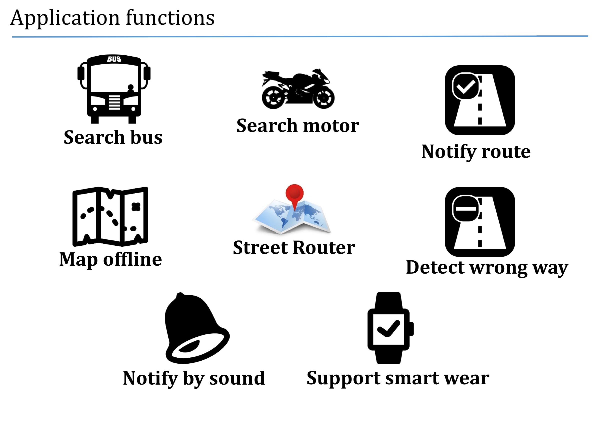

# Video
- **Application introduction:**&nbsp;&nbsp;&nbsp;&nbsp;&nbsp;https://www.youtube.com/watch?v=JqmobPpK5Xk
- **Application Demo:**&nbsp;&nbsp;&nbsp;&nbsp;&nbsp;&nbsp;&nbsp;&nbsp;&nbsp;&nbsp;&nbsp;&nbsp;&nbsp;&nbsp;&nbsp;&nbsp;&nbsp;&nbsp;&nbsp;&nbsp;https://www.youtube.com/watch?v=6t8c6KFUmpk
- **Capstone Presentation:**&nbsp;&nbsp;&nbsp;&nbsp;&nbsp;&nbsp;&nbsp;&nbsp;&nbsp;&nbsp;https://www.youtube.com/watch?v=-RSx8lwOlIQ

# Application Download
You can try our application at this link :) Please go to `Setting\Download Map Offlines` for using Nutiteq Map Offline, Because Nutiteq Map Online is slower than Google Map. 
We certificated second prize in **<a href="http://sohoa.vnexpress.net/tin-tuc/doi-song-so/bon-doi-lot-vao-chung-ket-s-m-a-c-challenge-2015-3313513.html">S.M.A.C Challenge 2015</a>** Contest with this application. **Cheer !!!!!**  
<a href="https://play.google.com/store/apps/details?id=com.fpt.router">Street Router on Play Store</a>

# System Overview

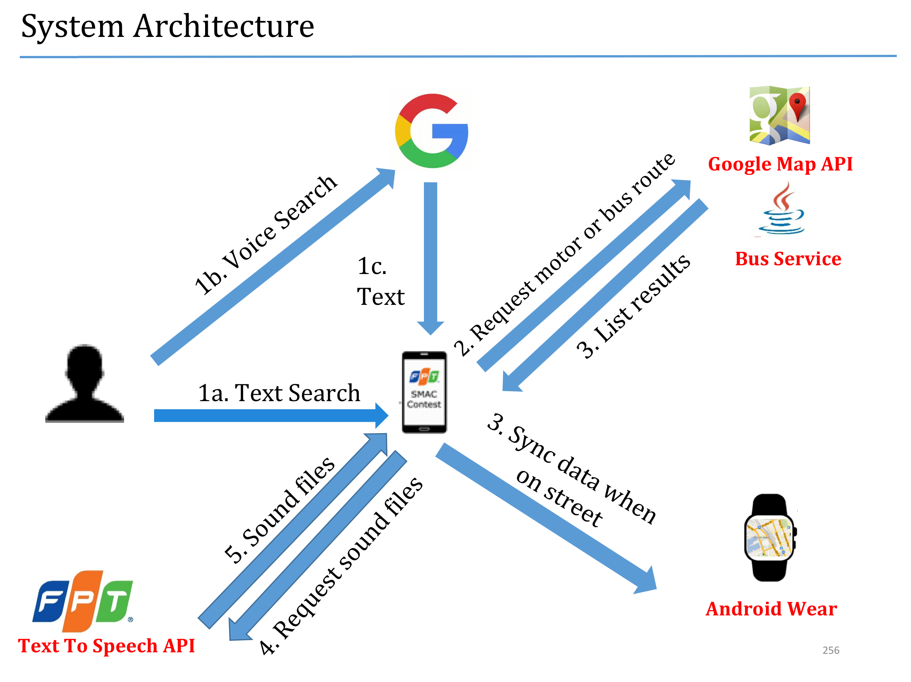

## Wear Architecture

 <table>
  <tr>
    <td> </td>
    <td> 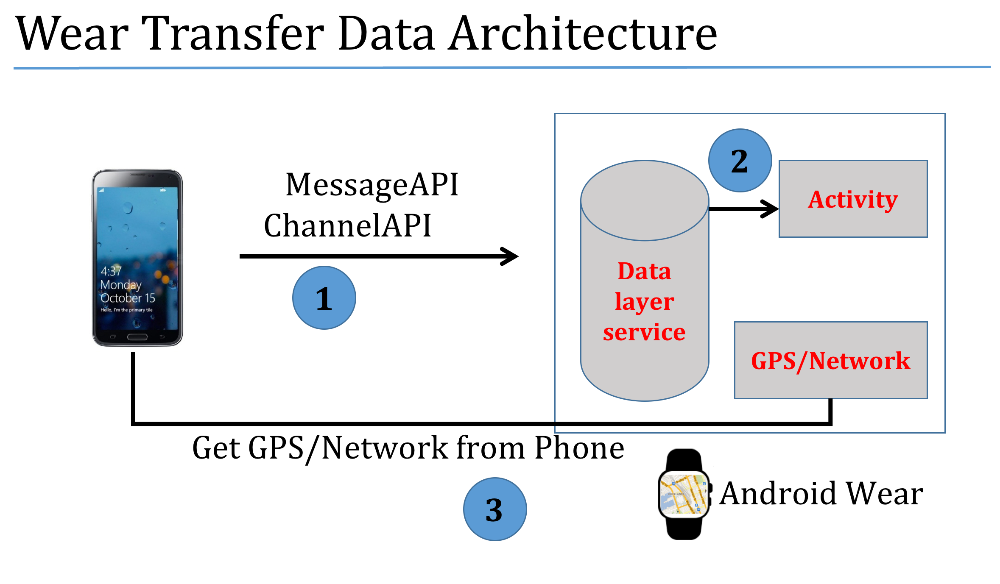&nbsp;&nbsp;&nbsp;</td>
  </tr>
</table>

## Wear Transfer Data Architecture
 <table>
  <tr>
    <td> 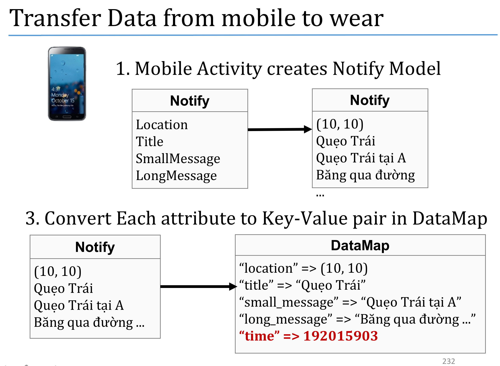</td>
    <td> 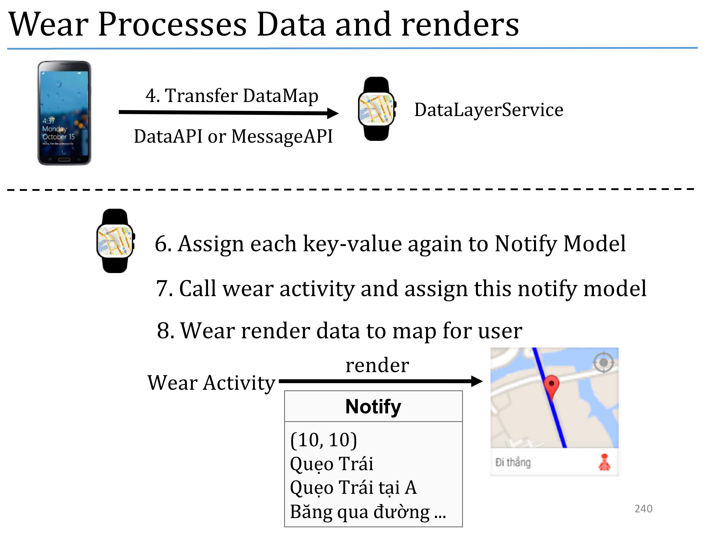</td>
  </tr>
</table>

## Database Diagram
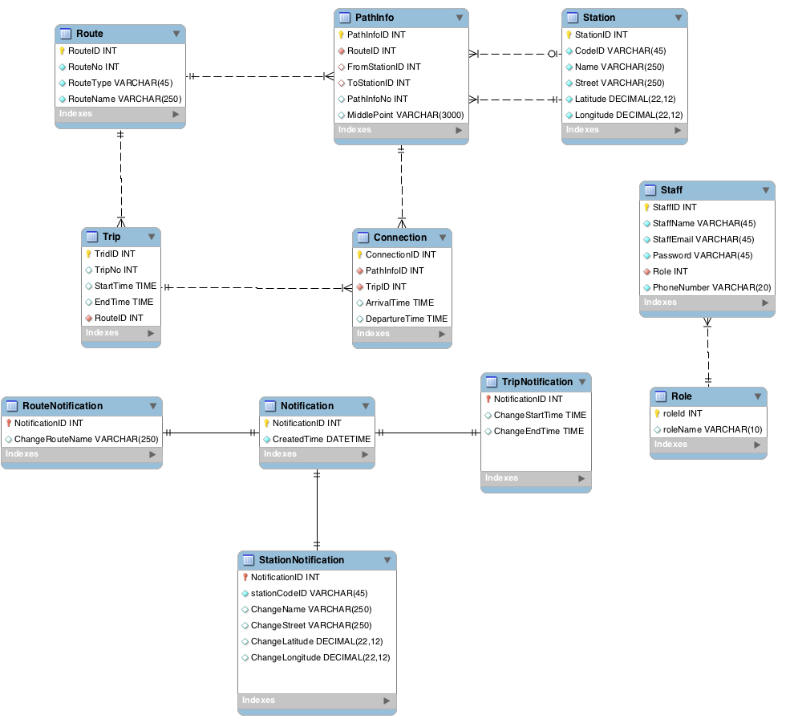

# Algorithm
We provides many algorithms for supporting our application. Please see `Document\Presentation\full presentation.pptx` or `Document\ReportFinally.docx` for more detail how we implement those algorithm.

## Raptor algorithm
We implement from scratch Raptor algorithm based on paper **Round-Based Public Transit Routing** of a group of computer scientists at Microsoft, 2012. This algorithm supports finding shortest public transportation route including some interesting parameters such as *departure time, arrvial time, number of transfers, ticket price, priority zones ...*   
<i>**We see that this algorithm doesn't have full well-implemented version on internet. So if you feel interested with this algorithm, please see our source code or contact us for more detail. We are very happy and appreciate to discuss with you :)**</i>  
 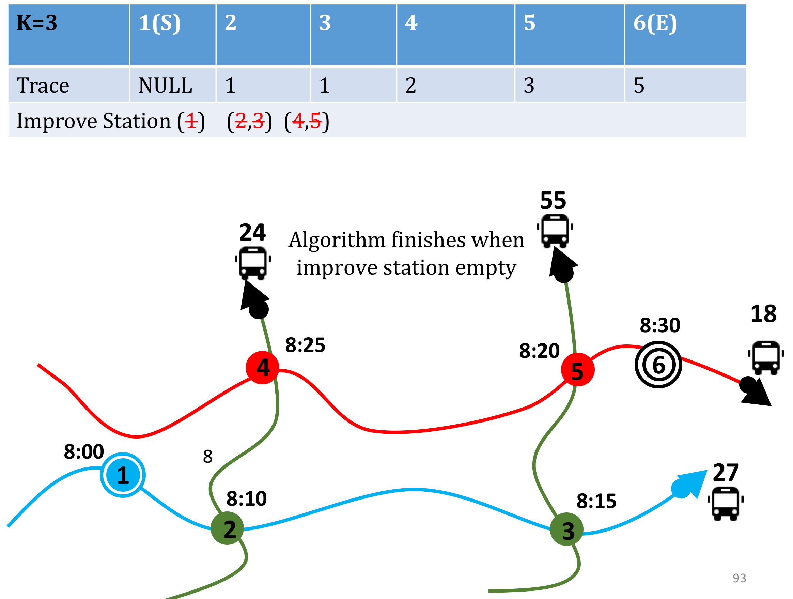  
 *image illustration for raptor algorithm*

 **Route Detect Notification Algorithm**  
 We implement two version of this algorithm:
 - **Next Route Notification Algorithm:** algorithm is used for notify which turn should to be notified in next. 
 - **Wrong Route Detection Algorithm:** algorithm is used for detection when user go to wrong route, and can recommend true way again from current point to searched route.

 <table>
  <tr>
    <td><b>Next Route Notification Algorithm</b></td>
    <td><b>Wrong Route Detection Algorithm</b></td>
  </tr>
  <tr>
    <td bgcolor="#fff"> 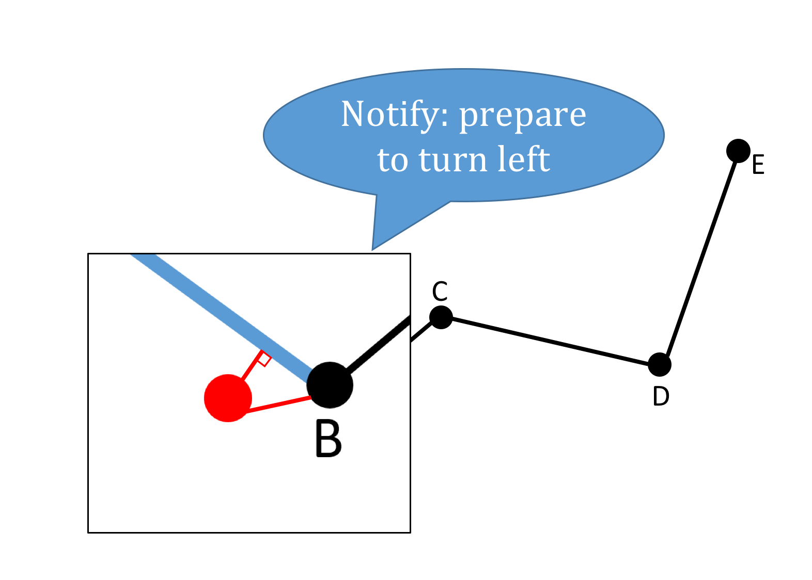&nbsp;&nbsp;&nbsp;</td>
    <td bgcolor="#fff"> &nbsp;&nbsp;&nbsp;</td>
  </tr>
</table>
 *image illustration for route detect notification algorithm*

# Documentation
## Project Information

- **Project name**: Smart Wear On Your Route
- **Project Code**: SWR
- **Product Type**: Website & Android Application
- **Start Date**: September 7th, 2015
- **End Date**: December 20th,2015

## Current Situation
Nowadays, when participating in traffic, user often wants to find route through some locations. This situation becomes more important especially participating by bus or motorbike. Currently, mobile market has some applications that support searching route such as Google map or BusMap.

## Problem Definition
Below are disadvantages of current situation:
-	**BusMap doesn't support searching motorbike route:** BusMap only searches Ho Chi Minh city bus route. 
-	**BusMap and Google Map don’t support time constraint when finding route:** Time constraints include departure time and arrivial time. By including time in search parameters, user can find more suitable routes when participating traffic such as peak-time.
-	**No application supports searching through more than two points:** In some situation, user needs to find route go through many locations, such as starting home, and go to supermarket, company and friend's house.
-	**No application supports routing turn-by-turn when participating traffic:** Currently, user only can searches and view result when on street by looking on motorbike. No notification mechanism supports user can drive motorbike without see mobile's screen and can receive information which should to do in next turn. For example, when user is near next turn, will have notification named "quẹo phải tại vòng xoay Hàng Xanh" 
-	**No application supports sound notification when participating traffic:** Sound notification supports user turn-by-turn navigation more easily by alarm by sound such as said "Quẹo trái tại công viên Lê Văn Tám".
-	**Google Map has supports map offline with some limitations:** Download area is limit with 50km x 50km and will be expired after 30 days. After 30 days, user must download that area again.
-  **Supporting smartwatch routing when participating traffic:** BusMap and Google Map curently don't support routing on smart watch. There are some disadvantages of using only smartphone to find route such as theft, inconvenience, no safety in motorbike control as well as the bus.

## Proposed Solution
Our proposed solution is to build and mobile application and android wear application named **“Smart Wear on Your Route”** to resolve the current situations. We also design the system to be scalable so we can extend our system for more platforms (iOS, Windows Phone) in the future and can be used for more transit protocols (train, high-speed train)
SWR system includes a web application, background process, mobile application and wear application with following functions:

### Feature functions

#### Mobile application: 
developing functions on mobile supports user search bus route or motorbike route both using voice or typing. Mobile functions also support user route when participating traffic using voice or text. Also mobile functions will support user recommend right route when they are on wrong way.
- **Searching bus route through from two points to four points:** user inputs start point, two optional middle points and end point and optional departure time. Application will find the best bus route from start point through middle points to end point which optimize condition (shortest time, least number change route)
- **Find bus route through from two points to four points with optimize:** user inputs start point, two optional middle points and end point and optional departure time, then choose “optimize” option. Application will find the best bus route from start point through three points which optimize condition (shortest time, least number change route), no matter order last three points.
- **Find motorcycle route through from two points to four points:** user inputs start point, two optional middle points and end point and optional departure time. Application will find the best motorcycle route from start point through middle points to end point which optimize condition shortest time.
- **Find motorcycle route through from two points to four points with optimize:** user inputs start point, two optional middle points and end point and optional departure time, then choose “optimize” option. Application will find the best motorcycle route from start point through three points which optimize condition shortest time, no matter order last three points.
- **Assist user searching using typing or voice command:** User has two ways for input data: Using keyboard and typing text or using voice command.
- **Routing bus route:** when user chooses one bus route for participating traffic, application will start for tracking user’s location, and notify message (by vibrate, notification, sound) when user is near a bus station that need to get off station. 
- **Routing motorbike route:** when user chooses one motorbike route for participating traffic, application will start for tracking user’s location, and notify message (by vibrate, notification, sound) when user is near a turn. Application also notify message when user goes to wrong route and recommmend suitable message when come to searched route again.
- **Detect wrong motorbike route:** When users go to wrong route, application will detect and notify message periodically for users know that they have gone wrong route.
- **Recommend suitable motorbike direction for user when user is near searched route:** when user is on wrong route and go near again searched route, application will recommend suitable direction for user.
- **Map offline:** By using map offline, user can use routing function without network connectivity.

#### Wear app: 
functions developing on wear supports user easily navigate searched route (i.e: when participating traffic, so user doesn’t need to open mobile).	
- **Bus:** Application will notify for user when bus nears the station that user should to leave: if bus in circular range of station of the route's plan, application will show the message name of the next station.
- **Motorcycle:**
    - App will notify when user has to turn route: If user drives in circular range of next turn, application will automatically show message which should to do next and vibrate until user out of this range.
    - App will notify when user goes to wrong route: If user goes to wrong route compare to original searched route, application will automatically show message that user has gone to wrong route.
- **Map:** Show your current location: show current user location on map with route user should to go (including bus or motorbike).

#### Web application:
Design for staff. Those functions support staff manage route and bus timetable. So Staff can approve or reject data change before saving to database.
- **Notify new update data from server to staff:**  if official website (http://www.buyttphcm.com.vn/) has new data, background process will notify to staff and staff will decide approve this update or not.
- **Check new data periodically:** Background process will check new data at 0 AM each day. If background process detects that data has been changed, background process will write new data to temporary database and notify messages for staff.

# Complete documentation

See `Document` directory.

# Finally ...

Our picture with our supervisor.
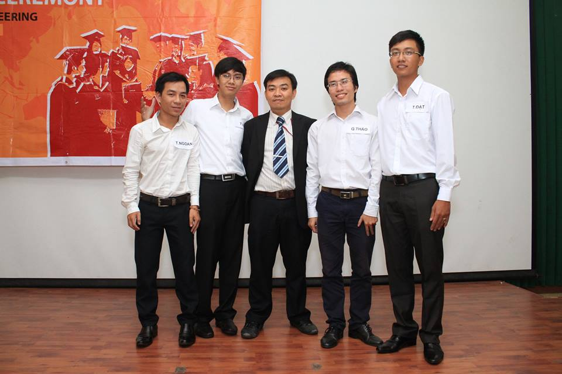

Our winning time. Cannot forget :)
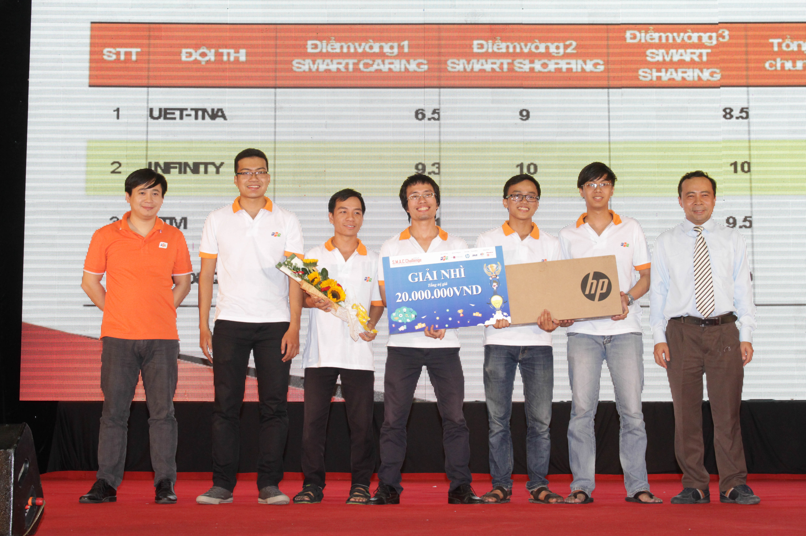

### Thanks for watching our presentation